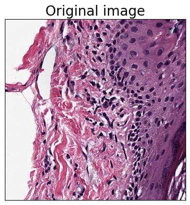

```{r setup, include = FALSE}
knitr::opts_chunk$set(
  comment = "#>", collapse = TRUE, fig.align = 'center',
  # eval = AnVIL::gcloud_exists(),
  eval = FALSE
)
```

# Introduction
For the introduction and setup of AnVILWorkflow package, please reference the
overview section [this vignette][].

[this vignette]: https://bioconductor.org/packages/devel/bioc/vignettes/AnVILWorkflow/inst/doc/salmon.html#overview


# Quickstart
```{r eval=FALSE}
library(AnVILWorkflow)
gcloud_exists() # Should be `TRUE`. Unless install gcloud SDK

## Setup the account
accountEmail <- "shbrief@gmail.com"
billingProjectName <- "waldronlab-terra-rstudio"
setCloudEnv(accountEmail = accountEmail, 
            billingProjectName = billingProjectName)

# ## Look up the template workspace
# all_analysis <- availableAnalysis(curatedOnly = FALSE, keyword = "pathml")
# templateName = all_analysis$name

## Clone the workspace
newName = "pathml_test"
templateName = "PathML_Preprocessing"
cloneWorkspace(workspaceName = newName, 
               templateName = templateName)

# ## Update the input
# config <- getWorkflowConfig(newName)
# current_input <- currentInput(newName, config)
# new_input <- current_input
# new_input[1,4] <- "\"gs://sh_misc/CMU-1-Small-Region.svs\"" # Can provide different input
# updateInput(newName, inputs = new_input) # add `dry = FALSE` to change

## Run workflow
runWorkflow(newName)

# ## Monitor workflow submission status
# monitorWorkflow(workspaceName = newName)

## Get workflow
getOutput(workspaceName = newName, 
          dest_dir = "pathml_outputs",
          dry = FALSE)
```




# Setup

## Clone workspace
### Curated by this package

We will refer the existing workspaces, that you have access to and want
to use for your analysis, as 'template' workspaces. The first step of
using this package is cloning the template workspace using `cloneWorkspace`
function. Note that you need to provide a **unique** name for the cloned
workspace through `workspaceName` argument. Once you successfully clone 
the workspace, the function will return the name of the cloned workspace.

```{r}
all_analysis <- availableAnalysis(curatedOnly = FALSE, keyword = "pathml")
all_analysis
```


```{r}
newName = "pathml_test"
cloneWorkspace(workspaceName = newName, 
               templateName = "pathml_stain_normalization_template")
```


## Prepare input

### Current input

You can review the current inputs using `currentInput` function. Below
shows all the required and optional inputs for the workflow. 

```{r}
config <- getWorkflowConfig(newName)
current_input <- currentInput(newName, config)
current_input
```

<br>

### Update input
You can modify/update inputs of your workflow using `updateInput` function. To
minimize the formatting issues, we recommend to make any change in the current 
input table returned from the `currentInput` function. Under the default 
(`dry=TRUE`), the updated input table will be returned without actually
updating Terra/AnVIL. Set `dry=FALSE`, to make a change in Terra/AnVIL.

```{r}
new_input <- current_input
new_input[2,4] <- "test" # change sample name
new_input

updateInput(newName, inputs = new_input) # add `dry = FALSE` to change
```


# Run workflow

You can launch the workflow using `runWorkflow()` function. 
```{r eval=FALSE}
runWorkflow(newName)
```

In case the selected workflow uses Terra's data model, you need to specify 
the `inputName` of your workflow. If you don't provide it, this function will 
return the list of input names you can use for your workflow.

```{r}
getDataTables(newName)
getDataTables(newName, table = "image")
```

```{r echo=FALSE, eval=FALSE}
## Data model version
new_input$attribute <- c("this.image_svs", "this.sampleName")
updateInput(newName, inputs = new_input, dry = FALSE) 
# runWorkflow(newName, inputName = "")
```

## Monitor progress

The last three columns (`status`, `succeeded`, and `failed`) show the 
submission and the result status. 

```{r}
submissions <- monitorWorkflow(workspaceName = newName)
submissions
```

## Abort submission

You can abort the most recently submitted job using the `stopWorkflow` 
function. You can abort any workflow that is not the most recently
submitted by providing a specific `submissionId`.

```{r}
stopWorkflow(newName)
```

# Result

The workspace `Bioconductor-Workflow-DESeq2` is the template workspace 
you cloned at the beginning using the `analysis = "salmon"` argument 
in `cloneWorkspace()` function. This template workspace has already a 
history of the previous submissions, so we will check the output examples 
in this workspace.

```{r}
submissions <- monitorWorkflow(workspaceName = newName)
submissions
```

You can check all the output files from the most recently succeeded
submission using `getOutput` function. If you specify the `submissionId` 
argument, you can get the output files of that specific submission.

```{r}
out <- getOutput(workspaceName = newName)
out
```

```{r}
getOutput(workspaceName = newName, 
          dest_dir = "pathml_outputs",
          dry = FALSE)
```


# Session Info
```{r eval=TRUE}
sessionInfo()
```
